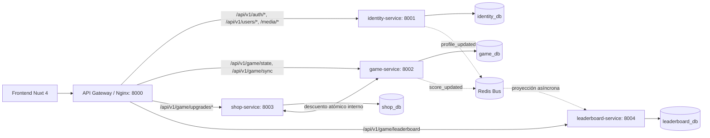

# solid-octo-fiesta

Sistema Clicker/Idle con **Nuxt 4 + TailwindCSS** y arquitectura de **Microservicios en Django REST Framework + PostgreSQL + Redis + Nginx**.

[](https://youtu.be/TveN0HJzLfk)

[Link directo](https://youtu.be/TveN0HJzLfk)

---

## 🏛️ Arquitectura de Microservicios

El sistema está dividido en microservicios independientes, desacoplados mediante bases de datos por servicio, autenticación JWT distribuida (stateless) y eventos asíncronos en Redis:



### Servicios:
1. **`gateway` (Nginx - Puerto 8000):**
   - Enrutador inverso de entrada. Mantiene los contratos de API existentes para el cliente frontend sin romper rutas.
2. **`identity-service` (Django - Puerto 8001):**
   - Autenticación (registro, login, refresh, logout), usuario personalizado y actualización de perfil/avatares.
   - Base de datos: `identity_db`.
3. **`game-service` (Django - Puerto 8002):**
   - Gestión de progreso (`PlayerProgress`), estado inicial (`/game/state`) y sincronizaciones de alta frecuencia (`/game/sync`).
   - Emite eventos `score_updated` al bus Redis para mantener actualizado el ranking sin bloquear la base de datos de juego.
   - Expone endpoint interno protegido `/api/v1/internal/deduct-points` para compras de mejoras.
   - Base de datos: `game_db`.
4. **`shop-service` (Django - Puerto 8003):**
   - Catálogo de mejoras (`clicker`, `static`, `spammer`) e inventario de mejoras por jugador (`PlayerUpgrade`).
   - Verifica saldo con `game-service` y registra compras de forma aislada.
   - Base de datos: `shop_db`.
5. **`leaderboard-service` (Django - Puerto 8004):**
   - Proyección de ranking de lectura ultra-rápida (`LeaderboardEntry`).
   - Un worker en segundo plano consume eventos de Redis (`score_updated`, `profile_updated`, `user_registered`) y actualiza su base de datos de lectura de forma asíncrona (CQRS).
   - Base de datos: `leaderboard_db`.
6. **`frontend` (Nuxt 4 - Puerto 3000):**
   - Aplicación SSR/SPA en Nuxt 4 que consume la API a través del API Gateway.

---

## 🚀 Arranque Rápido con Docker

Para levantar toda la arquitectura de microservicios en tu máquina local:

```bash
bash scripts/start-local.sh
```

El script preparará los `.env` necesarios, construirá las imágenes y levantará todos los contenedores:
- **Frontend (Nuxt):** [http://localhost:3000](http://localhost:3000)
- **API Gateway:** [http://localhost:8000/api/v1/health](http://localhost:8000/api/v1/health)
- **Identity Service:** [http://localhost:8001](http://localhost:8001)
- **Game Service:** [http://localhost:8002](http://localhost:8002)
- **Shop Service:** [http://localhost:8003](http://localhost:8003)
- **Leaderboard Service:** [http://localhost:8004](http://localhost:8004)
- **PostgreSQL:** `localhost:5432` (con `identity_db`, `game_db`, `shop_db`, `leaderboard_db`)
- **Redis:** `localhost:6379`

### Comandos útiles:

```bash
# Ver logs en vivo de todos los servicios
sudo docker compose logs -f

# Ver logs de un microservicio específico
sudo docker compose logs -f identity-service
sudo docker compose logs -f game-service
sudo docker compose logs -f shop-service
sudo docker compose logs -f leaderboard-service
sudo docker compose logs -f gateway

# Crear un superusuario de Django en identity-service
bash scripts/create-superuser.sh

# Detener los contenedores
bash scripts/stop-local.sh
```

---

## 🚢 Despliegue Independiente de Microservicios

Cada microservicio en `services/<nombre-servicio>` es completamente autónomo y cuenta con:
- Su propio `Dockerfile`.
- Su propio `requirements.txt`.
- Su propio `entrypoint.sh` con migraciones automáticas.
- Su propio archivo `.env.example`.
- Compatibilidad total con PostgreSQL local y remoto (`DATABASE_URL`, `DB_SSL_REQUIRE=1` para Supabase, Neon, RDS, etc.).

### Construcción de imágenes Docker individuales:

```bash
# Gateway
docker build -t solid-octo-gateway ./services/gateway

# Identity Service
docker build -t solid-octo-identity ./services/identity-service

# Game Progress Service
docker build -t solid-octo-game ./services/game-service

# Shop Service
docker build -t solid-octo-shop ./services/shop-service

# Leaderboard Service
docker build -t solid-octo-leaderboard ./services/leaderboard-service

# Frontend
docker build -t solid-octo-frontend ./frontend
```

---

## 🔐 Seguridad y Autenticación Distribuida

- **SimpleJWT Compartido:** `identity-service` emite los tokens JWT firmados con `JWT_SIGNING_KEY`. Los demás microservicios (`game-service`, `shop-service`) validan el token de forma puramente criptográfica (stateless), extrayendo `user_id` y `nickname` sin necesidad de consultar la base de datos de usuarios en cada petición.
- **Comunicación Interna:** Las llamadas directas entre microservicios (como el descuento de puntos entre `shop-service` y `game-service`) se protegen mediante el header `X-Internal-Secret: <INTERNAL_API_SECRET>`.

---

## ☁️ Infraestructura en la Nube (GCP + Terraform)

Para desplegar la arquitectura completa en Google Cloud Platform con una máquina virtual Compute Engine de bajo costo (`e2-small` con Swap) y una **IP pública estática**, consulta la guía detallada en [infra/README.md](infra/README.md).
