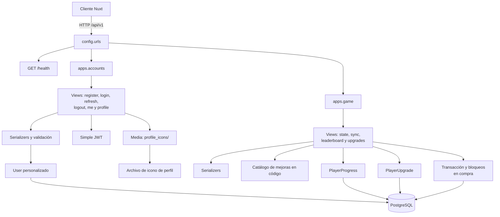
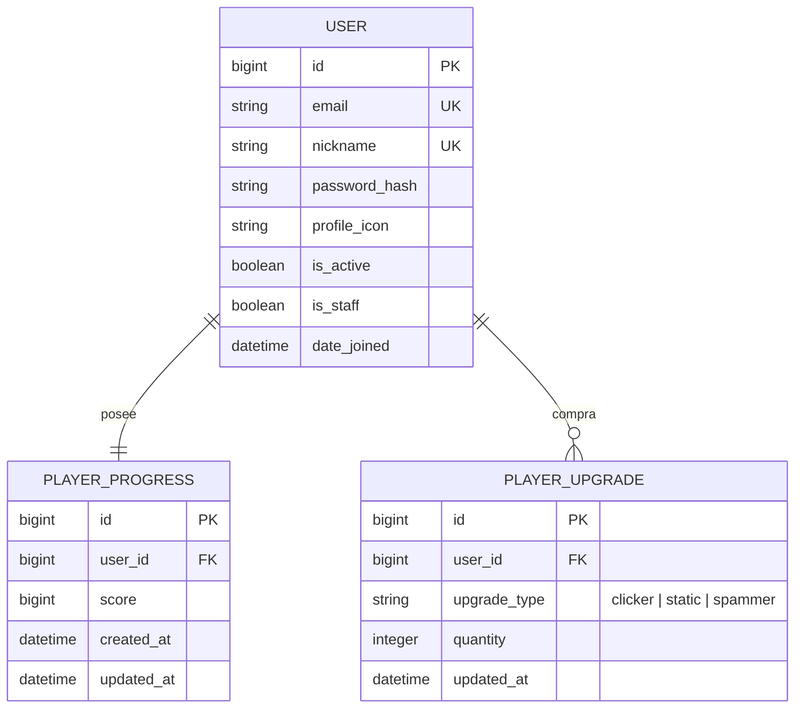

# Arquitectura del backend y modelo de datos

**Razón de existir:** localiza las responsabilidades del monolito Django y documenta qué entidades intervienen en autenticación, progreso, compras y ranking. Sirve como referencia antes de modificar endpoints o migraciones.

## Arquitectura backend

El `User` personalizado identifica al jugador por correo. `apps.accounts` crea el progreso inicial durante el registro; `apps.game` centraliza el estado, las sincronizaciones y las compras. El catálogo de tipos, precios y producción de mejoras (`clicker`, `static`, `spammer`) vive actualmente en código y las cantidades compradas viven en la base de datos.

## Modelo de datos relevante

| Tabla | Propósito y reglas importantes |
| --- | --- |
| `accounts_user` | Cuenta del jugador. `email` y `nickname` son únicos; el icono de perfil es opcional. |
| `game_playerprogress` | Estado persistente del juego. Existe exactamente un registro por usuario (`user_id` uno a uno) y conserva el `score` más reciente. |
| `game_playerupgrade` | Cantidad adquirida de cada tipo de mejora por jugador. La combinación (`user_id`, `upgrade_type`) es única; la compra bloquea las filas dentro de una transacción para descontar puntos y aumentar la cantidad de forma atómica. |
