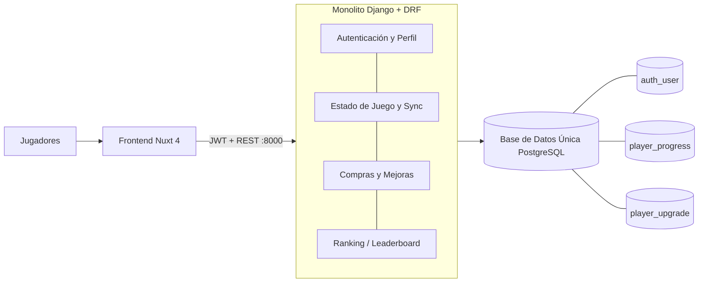
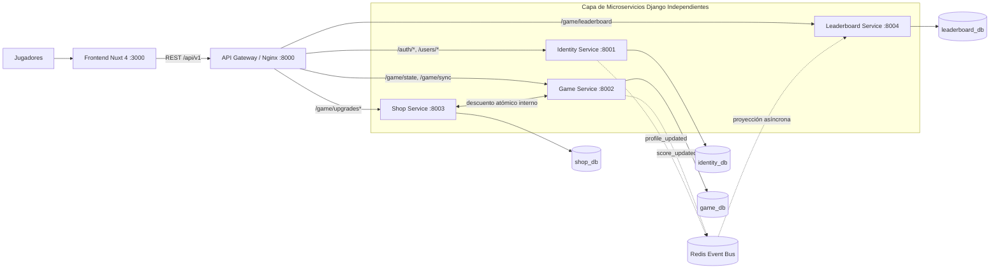

# Evolución de la Arquitectura: Monolito vs Microservicios

Comparativa de alto nivel entre la arquitectura monolítica original y la arquitectura actual desacoplada en microservicios independientes orientada a eventos.

## 1. Estado Anterior: Backend Monolítico

## 2. Nuevo Estado Actual: Microservicios Desacoplados

