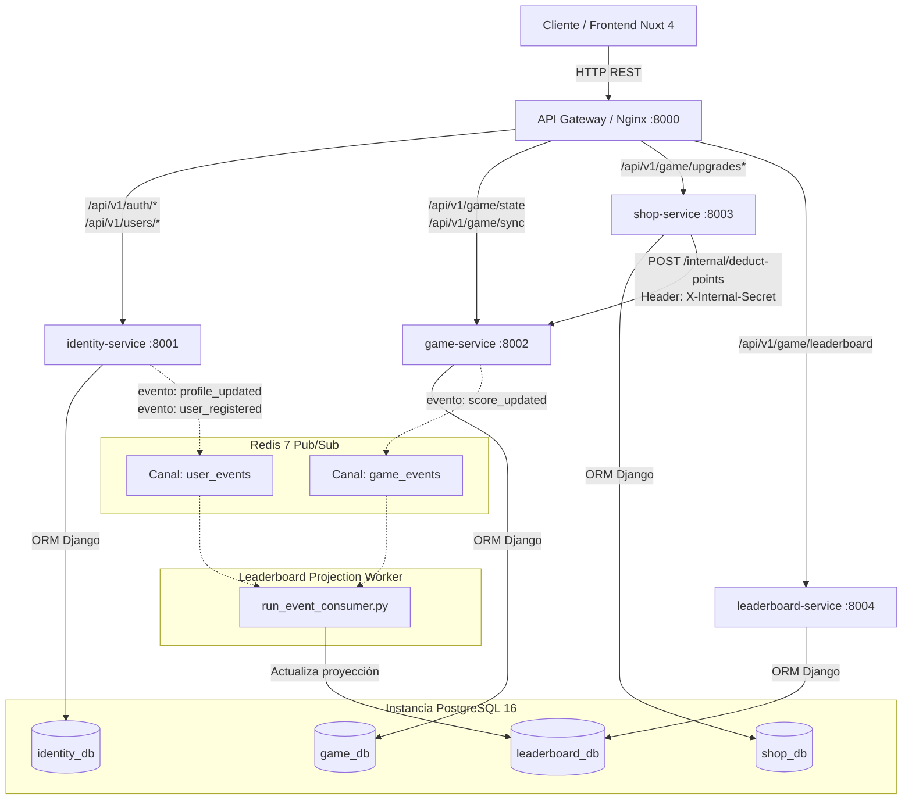

# Arquitectura Detallada del Backend y Bases de Datos

Detalle de interacción entre los microservicios Django, sus bases de datos PostgreSQL aisladas, el bus de eventos en Redis y el modelo de datos desacoplado por `user_id`.

## 1. Flujo de Comunicación e Integración de Servicios



## 2. Modelo de Datos Desacoplado (Sin Foreign Keys entre Servicios)

```mermaid
erDiagram
    %% Identity DB
    CUSTOM_USER {
        bigint id PK
        string email UK
        string nickname UK
        string profile_icon
        datetime created_at
    }

    %% Game DB
    PLAYER_PROGRESS {
        bigint id PK
        bigint user_id UK "Desacoplado (Claim JWT)"
        bigint score
        datetime updated_at
    }

    %% Shop DB
    PLAYER_UPGRADE {
        bigint id PK
        bigint user_id "Desacoplado (Claim JWT)"
        string upgrade_type
        int quantity
        datetime updated_at
    }

    %% Leaderboard DB
    LEADERBOARD_ENTRY {
        bigint id PK
        bigint user_id UK "Desacoplado (Id Proyectado)"
        string nickname
        bigint score
        string profile_icon
        datetime updated_at
    }

    CUSTOM_USER -.->|"user_id (vía JWT)"| PLAYER_PROGRESS
    CUSTOM_USER -.->|"user_id (vía JWT)"| PLAYER_UPGRADE
    PLAYER_PROGRESS -.->|"evento asíncrono"| LEADERBOARD_ENTRY
```
