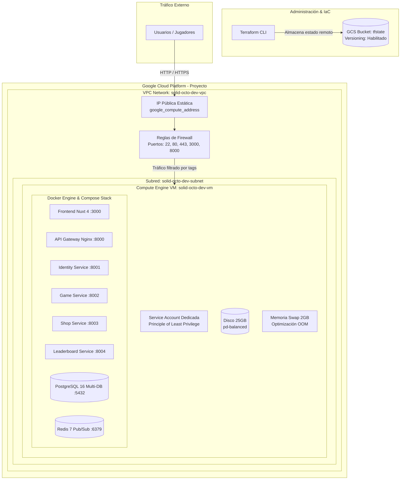
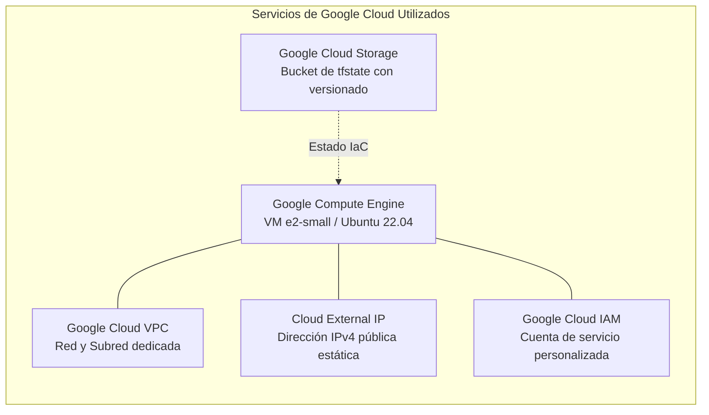

# Infraestructura en Google Cloud Platform (GCP)

Overview de la infraestructura aprovisionada mediante Terraform en GCP, destacando la red VPC, políticas de seguridad, recursos de almacenamiento y la máquina virtual Compute Engine de bajo costo.

## 1. Topología de Infraestructura en GCP

## 2. Mapa de Servicios GCP Utilizados

