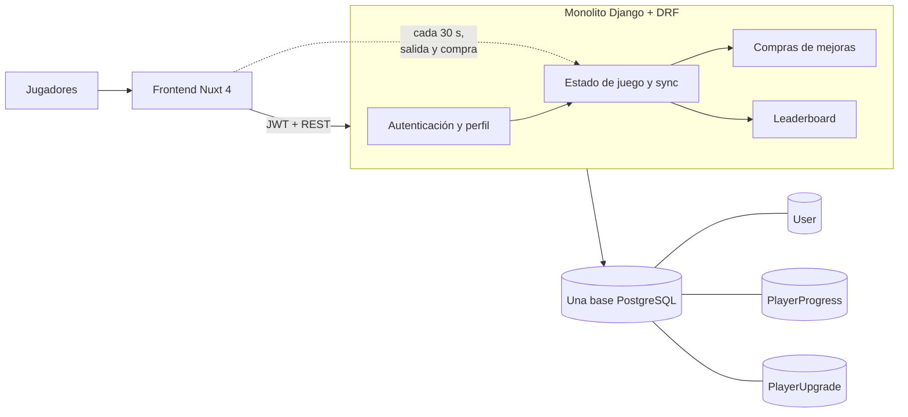
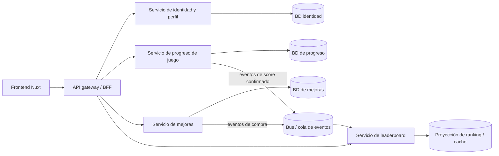

# Estado actual del sistema y evolución propuesta

**Razón de existir:** deja clara la frontera actual del monolito y por qué el camino de mayor crecimiento es separar los flujos con muchas escrituras de sincronización. Es una guía arquitectónica, no una migración ya implementada.

## Estado actual: backend monolítico y una sola base de datos

Actualmente hay un solo backend desplegable y una fuente de datos PostgreSQL para todos los dominios. Esta es una solución adecuada para el MVP: simplifica despliegue, transacciones de compra y consultas del ranking. El punto de presión es `POST /game/sync`, porque muchos jugadores activos generan escrituras frecuentes sobre el progreso.

## Dirección propuesta al aumentar la carga

Separar primero el servicio de progreso permite escalar, particionar o procesar por lotes las sincronizaciones sin competir con perfil, autenticación o ranking por las mismas tablas. Un ranking basado en una proyección alimentada por eventos reduce las lecturas ordenadas sobre la tabla transaccional. Las compras seguirían requiriendo una decisión explícita de consistencia entre progreso y mejoras; por ello es conveniente extraerlas junto al dominio de juego o diseñar un flujo transaccional/eventual bien definido.
